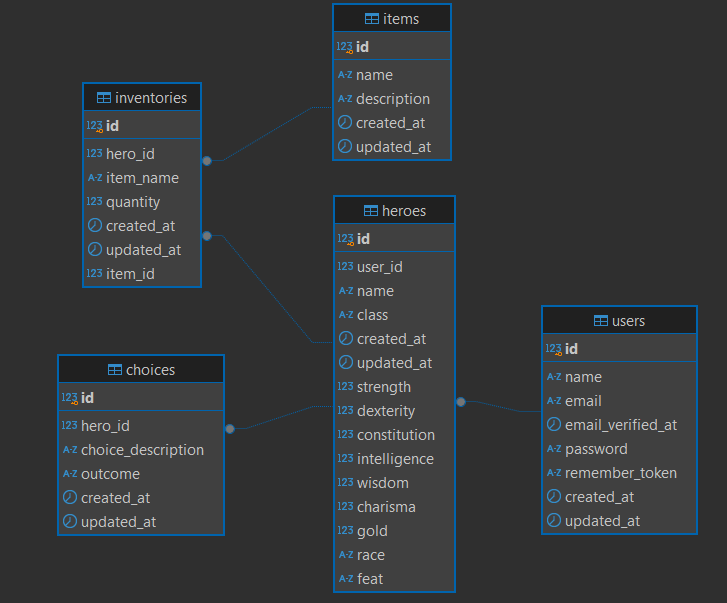

# Hero Game CYOA - Backend 

This is the backend for the CYOA Game, built using Laravel and PostgreSQL (can be switched to MySQL). The backend provides API endpoints for managing heroes, inventories, choices, and items within the game. Players can create heroes, equip items, make decisions, and track their progression through the game.

## Setup Instructions

### 1. Clone the Repository

```bash
git clone git@github.com:Yourisrachid/herogamebackend.git
cd herogamebackend
```

### 2. Install Dependencies

```bash
composer install
```

### 3. Setup Environment Variables

Copy the `.env.example` file to create your `.env` configuration file:

```bash
cp .env.example .env
```

Open the `.env` file and configure your database settings (either for PostgreSQL or MySQL):

```dotenv
DB_CONNECTION=pgsql
DB_HOST=127.0.0.1
DB_PORT=5432
DB_DATABASE=your_database_name
DB_USERNAME=your_username
DB_PASSWORD=your_password
```

### 4. Run Migrations

After configuring the `.env` file, run the database migrations to create the necessary tables:

```bash
php artisan migrate
```

### 5. Seed the Database (Optional)

To populate the items table with predefined items, you can run the database seeder:

```bash
php artisan db:seed --class=ItemSeeder
```




## API Endpoints

The backend provides the following API endpoints:

### Hero Management

#### Create a Hero (POST `/api/heroes`)

Create a new hero with class, stats, race, and feats.

**Example Request:**

```json
{
  "name": "Aragorn",
  "class": "warrior",
  "strength": 15,
  "dexterity": 13,
  "constitution": 14,
  "intelligence": 8,
  "wisdom": 12,
  "charisma": 10,
  "race": "human",
  "feat": "Solide"
}
```

#### Get a Hero (GET `/api/heroes/{heroId}`)

Retrieve details of a specific hero.

#### Update a Hero (PUT/PATCH `/api/heroes/{heroId}`)

Update the attributes of a hero.

#### Delete a Hero (DELETE `/api/heroes/{heroId}`)

Delete a hero from the database.

### Inventory Management

#### Add Item to Inventory (POST `/api/heroes/{heroId}/inventory`)

Add an item to a hero's inventory.

**Example Request:**

```json
{
  "item_id": 1,
  "quantity": 1
}
```

#### Remove Item from Inventory (DELETE `/api/heroes/{heroId}/inventory/{itemId}`)

Remove an item from the hero's inventory.

### Choice Management

#### Record a Choice (POST `/api/heroes/{heroId}/choices`)

Record a choice made by the hero during gameplay.

**Example Request:**

```json
{
  "choice_description": "Chose to enter the dark cave",
  "outcome": "Fought a dragon"
}
```

#### Retrieve Hero Choices (GET `/api/heroes/{heroId}/choices`)

Get all choices made by a hero.

### Items List

#### List All Items (GET `/api/items`)

Retrieve a list of all available items in the game.

**Example Response:**

```json
[
  {
    "id": 1,
    "name": "Sword",
    "description": "A sharp blade for close combat."
  },
  {
    "id": 2,
    "name": "Potion of Healing",
    "description": "Restores health when consumed."
  }
]
```

## Running the Application

To run the Laravel development server, use the following command:

```bash
php artisan serve
```

Your application should now be running at [http://localhost:8000](http://localhost:8000).

## All done !
